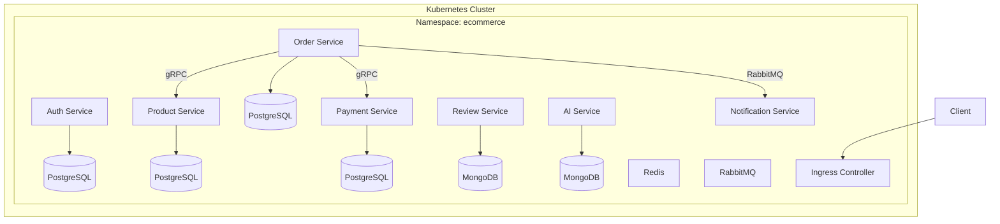
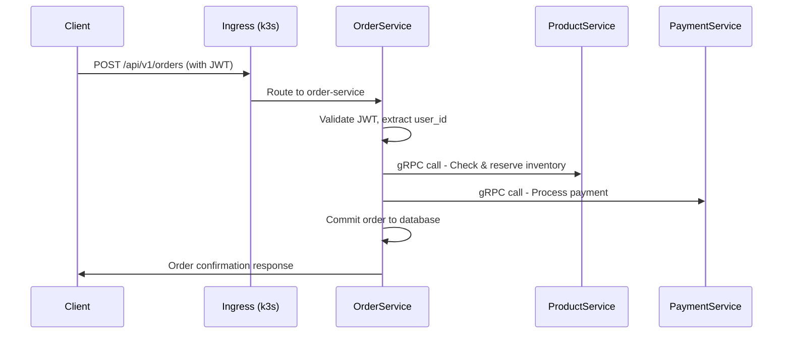
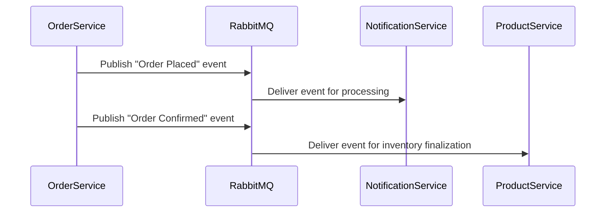

# E-Commerce Microservices Platform

A scalable, distributed e-commerce platform built with microservices architecture using FastAPI and Nest.js, containerized with Docker and orchestrated with Kubernetes (k3s).

## 🏗️ Architecture Overview

| Service | Example Name | Use Case | Stack | Container | Kubernetes |
|---------|--------------|----------|-------|-----------|------------|
| **Auth** | `auth-service` | Users, login, profile, roles, permissions | FastAPI / PostgreSQL / Redis | ✅ Dockerized | ✅ k3s Deployed |
| **Product** | `product-service` | Catalog, inventory, pricing, stock | FastAPI / PostgreSQL | ✅ Dockerized | ✅ k3s Deployed |
| **Orders** | `order-service` | Checkout, cart, purchases, order history | Nest.js / PostgreSQL | ✅ Dockerized | ✅ k3s Deployed |
| **Payment** | `payment-service` | Payment processing, invoices | Nest.js / PostgreSQL | ✅ Dockerized | ✅ k3s Deployed |
| **Reviews** | `review-service` | Star ratings, user comments | FastAPI / MongoDB | ✅ Dockerized | ✅ k3s Deployed |
| **Notifications** | `notification-service` | Email/SMS/push notifications | Nest.js / PostgreSQL | ✅ Dockerized | ✅ k3s Deployed |
| **AI/ML** | `ai-service` | Recommendations, search, predictions | FastAPI / MongoDB | ✅ Dockerized | ✅ k3s Deployed |

## 🚀 Services Details

### 1. Auth Service (`auth-service`)
- **Authentication**: JWT-based authentication with refresh tokens
- **Storage**: Redis for refresh token management
- **Models**: User, Role, Permission (access level)
- **API**: RESTful API endpoints
- **Container**: Multi-stage Docker build
- **K8s**: Deployment, Service, ConfigMap, Secret

### 2. Product Service (`product-service`)
- **Authentication**: Local JWT validation via access tokens
- **Models**: Hierarchical Category, Tag, Inventory, ProductImage, Product
- **API**: RESTful API endpoints
- **Container**: Optimized Python Docker image
- **K8s**: Horizontal Pod Autoscaler configured

### 3. Order Service (`order-service`)
- **Authentication**: Local JWT validation via access tokens
- **Models**: Order, OrderItem
- **API**: RESTful API endpoints
- **Communication**: gRPC for synchronous calls
- **Container**: Node.js Alpine-based image
- **K8s**: gRPC service configuration

### 4. Payment Service (`payment-service`)
- **Authentication**: Local JWT validation via access tokens
- **Models**: Payment
- **API**: RESTful API endpoints
- **Container**: Multi-stage Nest.js build
- **K8s**: Ingress resource for external access

### 5. Notification Service (`notification-service`)
- **Authentication**: Local JWT validation via access tokens
- **API**: RESTful API endpoints
- **Communication**: RabbitMQ for event-driven notifications
- **Container**: Lightweight Node.js image
- **K8s**: Message queue consumer deployment

### 6. Review Service (`review-service`)
- **Authentication**: Local JWT validation via access tokens
- **Database**: MongoDB for flexible schema
- **API**: RESTful API endpoints
- **Container**: Python with MongoDB driver
- **K8s**: StatefulSet for MongoDB

### 7. AI Service (`ai-service`)
- **Authentication**: Local JWT validation via access tokens
- **Database**: MongoDB for unstructured data
- **API**: RESTful API endpoints
- **Container**: ML-optimized Python image
- **K8s**: GPU support configuration (if available)

## 🐳 Docker Implementation

## Each service includes a optimized `Dockerfile`:

```dockerfile
# Example: FastAPI Service
FROM python:3.11-slim as builder
COPY requirements.txt .
RUN pip install --user -r requirements.txt

FROM python:3.11-slim
COPY --from=builder /root/.local /root/.local
COPY . .
CMD ["uvicorn", "app.main:app", "--host", "0.0.0.0", "--port", "8000"]

# Example: NestJS Service
FROM node:18-alpine as builder
WORKDIR /app
COPY package*.json ./
RUN npm ci
COPY . .
RUN npm run build

FROM node:18-alpine
WORKDIR /app
COPY --from=builder /app/dist ./dist
COPY --from=builder /app/node_modules ./node_modules
COPY package*.json ./
CMD ["node", "dist/main"]
```

### ☸️ Kubernetes (k3s) Implementation

## Cluster Architecture


## Deployment Strategy

# Example: product-service deployment
```
apiVersion: apps/v1
kind: Deployment
metadata:
  name: product-service
  namespace: ecommerce
spec:
  replicas: 3
  selector:
    matchLabels:
      app: product-service
  template:
    metadata:
      labels:
        app: product-service
    spec:
      containers:
      - name: product-service
        image: product-service:latest
        ports:
        - containerPort: 8000
        envFrom:
        - configMapRef:
            name: product-config
        - secretRef:
            name: database-secret
        resources:
          requests:
            memory: "256Mi"
            cpu: "250m"
          limits:
            memory: "512Mi"
            cpu: "500m"
```

### 🔄 Communication Flow: User Places Order

## Synchronous Communication (gRPC)


## Asynchronous Communication (RabbitMQ)

### 🚀 Deployment Workflow

## 1. Local Development
```
# Build and run with Docker Compose
docker-compose -f docker-compose.yml -f docker-compose.dev.yml up --build

# Or run individual services
cd services/auth-service
docker-compose up --build
```

## 2. Build Docker Images
```
# Build all services
docker-compose build

# Build specific service
docker build -t auth-service:latest ./services/auth-service
```

## 3. Deploy to k3s
```
# Apply Kubernetes manifests
kubectl apply -f k8s/namespaces.yaml
kubectl apply -f k8s/configs/
kubectl apply -f k8s/services/
kubectl apply -f k8s/deployments/

# Or use Helm charts (if available)
helm install ecommerce ./charts/ecommerce
```

## 4. Monitoring and Logging
```
# Check pod status
kubectl get pods -n ecommerce

# View logs
kubectl logs -f deployment/auth-service -n ecommerce

# Monitor resources
kubectl top pods -n ecommerce
```

### 🛠️ Technology Stack
- **Containerization: Docker, Docker Compose

- **Orchestration: Kubernetes (k3s)

- **Service Mesh: Traefik (k3s built-in)

- **Frameworks: FastAPI, Nest.js

- **Databases: PostgreSQL, MongoDB, Redis

- **Message Queue: RabbitMQ

- **Communication: gRPC (synchronous), RabbitMQ (asynchronous)

- **Authentication: JWT with role-based access control

### 📦 Project Structure
```
ecommerce-microservices/
├── services/
│   ├── auth-service/
│   │   ├── Dockerfile
│   │   ├── src/
│   │   └── k8s/               # K8s manifests per service
│   ├── product-service/
│   │   ├── Dockerfile
│   │   └── src/
│   └── ... (other services)
├── k8s/                       # Global Kubernetes manifests
│   ├── namespaces.yaml
│   ├── configs/               # ConfigMaps & Secrets
│   ├── services/              # Service definitions
│   ├── deployments/           # Deployment manifests
│   └── ingress/               # Ingress rules
├── docker-compose.yaml        # Local development
├── docker-compose.prod.yaml   # Production compose
└── README.md
```

### 📊 Kubernetes Features Implemented
- ✅ Multi-container pods with sidecar patterns

- ✅ ConfigMaps & Secrets for environment configuration

- ✅ Horizontal Pod Autoscaling based on CPU/memory

- ✅ Resource limits and requests

- ✅ Readiness and liveness probes

- ✅ Service discovery via k3s DNS

- ✅ Ingress routing with Traefik

- ✅ Persistent volumes for databases

- ✅ StatefulSets for stateful services

### 🚀 Getting Started

## Prerequisites
- 🐳 Docker Desktop

- ☸️ k3s or minikube

- ⚡ kubectl

- 📦 helm (optional)

## Local Development with k3s
```
# Start k3s cluster
k3d cluster create ecommerce-cluster

# Deploy all services
./deploy.sh

# Or deploy individually
kubectl apply -f k8s/namespaces.yaml
kubectl apply -f k8s/configs/database-config.yaml
kubectl apply -f k8s/services/auth-service.yaml
```

## Access Services
```
# Get ingress endpoints
kubectl get ingress -n ecommerce

# Port forward for local access
kubectl port-forward svc/auth-service 8000:8000 -n ecommerce
```

### 🔒 Production Considerations
- SSL/TLS termination at ingress

- Network policies for service isolation

- Pod security policies

- Backup strategies for persistent volumes

- Monitoring with Prometheus/Grafana

- Log aggregation with ELK stack

- CI/CD pipeline for automated deployments

### 📈 Performance Optimizations
- Connection pooling for databases

- gRPC load balancing with service mesh

- Redis caching for frequent queries

- Message batching in RabbitMQ consumers

- Horizontal scaling based on metrics

This implementation provides a production-ready microservices architecture with proper containerization and Kubernetes orchestration using k3s.


